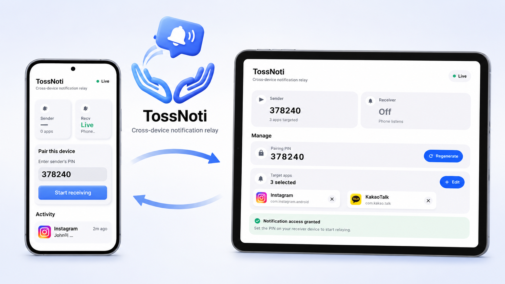
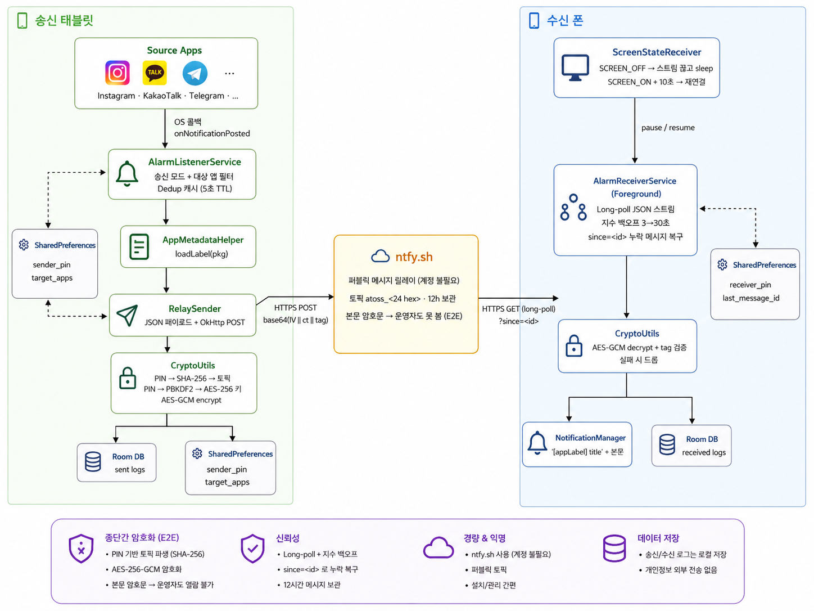

<div align="center">


# TossNoti

### 다른 기기의 알림을 내 폰으로 토스해주는 원격 알림 릴레이 앱

_Cross-device notification relay over an end-to-end encrypted channel._

### 📥 [TossNoti.apk 다운로드](https://github.com/FreakRYU/TossNoti/raw/main/dist/TossNoti.apk)

</div>

---

## 한 줄 소개

**태블릿에서 받은 인스타·카톡·텔레그램 알림을 PIN으로 페어링된 폰에 실시간으로 전달**. 내용은 종단간 암호화되어 어떤 서버도 못 읽고, 추가 인프라 셋업 없이 무료로 동작함.

## 왜 만들었나

### 배경 — 인스타그램의 기기 단위 차단

평소 쓰던 핸드폰이 인스타그램 알고리즘 판정으로 부당하게 차단되면서 시작된 프로젝트. 계정이 막힌 게 아니라 **기기 자체가 식별되어 차단**되는 케이스라, 같은 폰에서 새 계정을 만들어도 곧바로 다시 잠겼고 이의신청도 무력했음.

차단된 폰에선 무얼 해도 안 되니, 인스타그램이 한 번도 실행된 적 없는 **다른 기기(태블릿)에서 인스타 사용**으로 우회. 다만 이 경우 **인스타 알림을 보려면 매번 태블릿을 직접 들여다봐야 한다는 새로운 문제**가 생김. 메인 폰엔 다시 못 깔고.

→ **태블릿에 도착한 알림을 메인 폰으로 즉시 토스해주는 릴레이**가 이 프로젝트. 인스타뿐 아니라 **카톡, 텔레그램, 메일 등 송신 기기에 깔린 어떤 앱의 알림이든** PIN으로 페어링된 폰으로 전달됨.

비슷한 상황(특정 앱이 기기 단위로 막혔거나, 작업용 태블릿과 메인 폰을 분리해서 쓰는 경우)에 누구나 쓸 수 있도록 일반화함.

### 기존 솔루션들의 한계

- **KDE Connect** — 같은 Wi-Fi 필요, 설정 복잡
- **Pushbullet** — 유료, 미러링 기능 제한적
- **Tasker 등 자동화 앱** — 셋업 복잡, UI 다듬어지지 않음
- **FCM 직접 구현** — Firebase 프로젝트 셋업 필요

→ **PIN 6자리 입력 두 번**으로 셋업이 끝나는 가벼운 도구가 필요했음.

## 어떻게 만들어졌나

초기 아이디어부터 완성까지 **약 5시간** 소요.

1. **아이디어 정리** — 페어링 방식(PIN), 전송 채널(ntfy.sh), 양쪽 기기 역할 분리(`NotificationListenerService` + Foreground Service) 등 핵심 아키텍처 스케치.

2. **Google AI Studio (Gemini 3.5 Flash)** — 위 아이디어를 입력해 안드로이드 프로젝트 골격을 빠르게 생성. UI 기본 틀, 권한 처리, 메시지 송수신 뼈대 코드 자동 생성.

3. **Claude Code (Opus 4.7)에서 반복 개선** — 생성된 프로젝트를 로컬로 모두 내려받은 뒤, 다음 영역을 단계별로 코드 리뷰 + 수정:

   - **보안 강화** — AES-256-GCM + PBKDF2(100k 라운드) + 토픽 해시화
   - **UI 전면 재설계** — Coinbase 스타일 라이트 테마, Compose Material 3
   - **호환성 정비** — Samsung One UI Auto Blocker 대응, FGS 듀얼 타입(`dataSync|specialUse`), Android 7~16 지원
   - **신뢰성 보강** — 메시지 ID dedup(최근 64개), 지수 백오프 재연결, `?since=<timestamp>` 기반 누락 메시지 복구 (cursor empty/만료 시 `?since=12h` fallback)
   - **사용성 개선** — 앱 선택 Picker(설치된 모든 앱 검색), 권한 안내, 활동 로그 등

   총 **30여 개의 개별 개선** 반영.

## 주요 기능

- 🔒 **PIN 기반 페어링** — 6자리 PIN 한 번 입력으로 두 기기 연동
- 🔐 **종단간 암호화** — AES-256-GCM + PBKDF2(100k 라운드) 키 파생
- 📱 **앱 선택기** — 송신 기기에 설치된 모든 앱 중 가로챌 대상 선택 (검색 가능)
- 🏷 **실제 앱 이름 표시** — 인스타 알림은 `[Instagram]`, 카톡은 `[KakaoTalk]` 형식으로 자동 라벨링
- 📦 **중복 제거** — 같은 앱이 알림을 업데이트할 때 (예: "메시지 1개→2개") 중복 전송 방지
- 🔁 **자동 재연결** — 네트워크 끊겨도 지수 백오프로 재연결, `?since=` 파라미터로 누락 메시지 복구
- 🗂 **활동 로그** — 송수신 내역 시각화 + 삭제 / 일괄 비우기
- 💎 **Coinbase 스타일 라이트 UI** — Compose Material 3

## 작동 화면

<div align="center">



</div>

## 작동 방식

<div align="center">



</div>

### 핵심 개념

**PIN의 이중 역할**
| 파생 | 용도 |
|---|---|
| `SHA-256("salt\|PIN")` → 앞 24 hex | ntfy.sh 토픽 이름 (어디로 보낼지) |
| `PBKDF2(PIN, salt, 100k)` → 32 bytes | AES-256 키 (어떻게 암호화할지) |

같은 PIN을 양쪽에 입력해야 같은 토픽을 듣고 같은 키로 복호화 가능. PIN 모르는 사람은 토픽도 못 찾고, 운 좋게 찾아도 못 읽음.

**3가지 보장 메커니즘**
- 🔐 **기밀성** — AES-GCM 암호문은 키 없이는 못 읽음
- ✓ **무결성** — GCM 인증 태그가 1바이트만 바뀌어도 복호화 실패 → 변조된 메시지 자동 드롭
- 🔁 **신뢰성** — 끊겨도 `since=<last_id>` 커서로 ntfy의 12시간 보관 큐에서 누락 메시지 자동 복구

## 빌드 및 실행

### 필요 사항
- **Android Studio** (AGP 9.x 호환 버전, Narwhal+ 권장) 또는 동등한 CLI 환경
- **JDK 21** (Eclipse Adoptium / OpenJDK)
- **Android SDK Platform 36** (Android 16)
- **Android Build Tools 36.0.0**
- 양쪽 기기 모두 Android 7.0 (API 24) 이상

### 빌드
```bash
git clone https://github.com/<your-username>/TossNoti.git
cd TossNoti
./gradlew :app:assembleDebug
```

APK 위치: `app/build/outputs/apk/debug/app-debug.apk`

### 기기에 설치 (USB 디버깅 켠 상태)
```bash
./gradlew :app:installDebug
```

또는 APK 파일을 기기로 옮겨서 직접 탭.

> **참고**: 디버그 키스토어(`debug.keystore`)는 `.gitignore`에 포함되어 있어 저장소에 없음. 첫 빌드 시 직접 생성하거나, 기존 키스토어를 프로젝트 루트에 두면 됨:
> ```bash
> keytool -genkeypair -v -keystore debug.keystore -storetype PKCS12 \
>   -storepass android -alias androiddebugkey -keypass android \
>   -dname "CN=Android Debug,O=Android,C=US" \
>   -keyalg RSA -keysize 2048 -validity 10000
> ```

## 사용법

### 1) 두 기기 모두 설치
같은 APK를 송신 기기(태블릿)와 수신 기기(폰) 양쪽에 설치.

### 2) 송신 기기 (태블릿)
1. TossNoti 실행
2. 상단 탭에서 **Sender** 선택
3. **"Generate"** 눌러 6자리 PIN 생성
4. **알림 접근 권한 허용**: 시스템 설정 → 알림 → 특수 액세스 → TossNoti
5. **"앱 선택"** 눌러 가로챌 앱 지정 (인스타·카톡·텔레그램 등)

### 3) 수신 기기 (폰)
1. TossNoti 실행
2. 상단 탭에서 **Receiver** 선택
3. 송신 기기의 6자리 PIN 입력
4. **"Start receiving"** 누름

이제 송신 기기에 알림이 뜨면 수신 기기에서 자동으로 받아 표시함.

### 4) Samsung 사용자 — Auto Blocker 해제
설정 → 보안 및 개인정보 보호 → **Auto Blocker** → OFF

(One UI 6 이상부터 기본 ON. 이 토글이 켜져있으면 사이드로드와 ADB 설치가 차단됨)

### 5) 배터리 최적화 해제
설정 → 앱 → TossNoti → 배터리 → **제한 없음**

(특히 Samsung은 백그라운드 앱을 매우 공격적으로 종료시킴)

## 보안 모델

| 위협 | 방어 |
|---|---|
| ntfy 서버가 메시지 훔쳐봄 | AES-256-GCM 종단간 암호화 |
| MITM이 패킷 변조 | GCM 인증 태그로 변조 감지 |
| 누가 토픽 추측 / 무차별 대입 | SHA-256 해시 토픽 + PBKDF2 키 파생 (브루트포스 비용 약 28시간 CPU) |
| ISP / 와이파이 운영자가 내용 봄 | HTTPS + E2E |

**한계**: PIN 6자리(10⁶ 조합)는 진지한 공격자에겐 약함. 친구·가족·본인 기기간 사용엔 충분하지만 매우 민감한 정보엔 부적합. 진짜 안전이 필요하면:
- 더 긴 PIN (10+자리 영숫자)
- 자체 ntfy 서버 호스팅
- FCM으로 전환 (Google이 관리)

자세한 보안 분석은 [코드 주석 + CryptoUtils.kt 참고](app/src/main/java/com/example/security/CryptoUtils.kt).

## 한계 및 알려진 이슈

- ntfy.sh 무료 한도: **하루 250개 메시지**, **메시지당 4KB**. 이 정도는 개인용으로 충분.
- 페이로드는 텍스트만 전송하므로 메시지당 약 200-300B (아이콘 미전송).
- 폰 재부팅 시 수신 서비스 자동 시작 안 됨 (`BootReceiver` 미구현).
- 수신 서비스가 12시간 이상 중단되면 (네트워크 단절·OS의 백그라운드 종료 등) 그 사이의 알림은 ntfy 보관 만료로 손실 가능.
- 수신 모드는 ntfy long-poll 연결을 상시 유지하므로 배터리 소모가 일반 메신저 수준임. (Samsung 등 공격적인 OEM의 경우 "배터리 → 제한 없음" 설정 권장)

## 기술 스택

- **언어**: Kotlin 2.2.10
- **UI**: Jetpack Compose Material 3, light theme
- **DB**: Room 2.7.0 (with KSP)
- **네트워크**: OkHttp 4.10.0 (raw HTTP)
- **암호화**: javax.crypto (AES-GCM + PBKDF2)
- **메시지 릴레이**: [ntfy.sh](https://ntfy.sh)
- **빌드**: Gradle 9.3.1, AGP 9.1.1
- **최소 SDK**: 24 (Android 7.0), 타겟 SDK: 36 (Android 16)

## 라이선스

**프로젝트 코드**: [`LICENSE`](LICENSE) 파일 참고

**사용된 오픈소스**: [`THIRD_PARTY_LICENSES.md`](THIRD_PARTY_LICENSES.md) — 모든 의존성과 라이선스 목록

## Credits

- 메시지 릴레이 인프라: [ntfy.sh](https://ntfy.sh) by Philipp Heckel
- 앱 아이콘: ChatGPT 4o 이미지 생성
- 디자인 영감: Coinbase mobile app
- 영감을 준 비슷한 프로젝트들: KDE Connect, Pushbullet, Tasker

---

<div align="center">
<sub>Made with care for personal use. Not affiliated with any service mentioned above.</sub>
</div>
